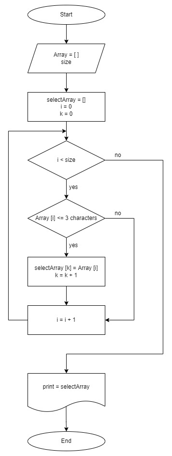

Описание решения задачи Итоговой проверочной работы
===================================================
## Задача
Написать программу, которая из имеющегося массива строк формирует массив из строк, длина которых меньше, либо равна 3 символа.
Первоначальный массив можно ввести с клавиатуры, либо задать на старте выполнения алгоритма.
При решении не рекомендуется пользоваться коллекциями, лучше обойтись исключительно массивами.

*Примеры:*
1. ["hello", "2", "world", ":-)"] -> ["2", ":-)"]
2. ["1234", "1567", "-2", "computer science"] -> ["-2"]
3. ["Russia", "Denmark", "Kazan"] -> []

**Решение**
* **Блок-схема**

* **Описание решения:**

1. Создание необходимого массива строк.

   1.1 Запрашиваем у пользователя текст элементов массива путём их ввода, в строку через пробел, с консоли.
   
   1.2 Создаём и формируем необходимый массив строк из введённых пользователем элементов.

2.  Создание нового массива строк и дополнительных переменных.

    2.1 Создаём новый массив строк длиной равной массиву из пункта 1.

    2.2 Задаём переменную k = 0, необходимую для последовательного заполнения нового массива.

    2.3  Задаём переменную i = 0, необходимую для последовательного прохождения по всем элементам массива A созданного в пункте 1.

3. Заполнение и формирование массива созданного в пункте 2, элементами из массива созданного в пункте 1, длина которых меньше, либо равна 3 символа.

   3.1 Используя цикл, перебираем все элементы массива созданного в пункте 1, от i до последнего элемента.
   Если количество символов элемента меньше или равно 3, то записываем данный элемент в массив созданный в пункте 2, в позицию под индексом k и увеличиваем переменную k на 1.

   3.2 После выполнения пункта 3.1, перезаписываем массив созданный в пункте 2, исключая пустые элементы массива.

4. Выводим в консоль перезаписанный массив.
